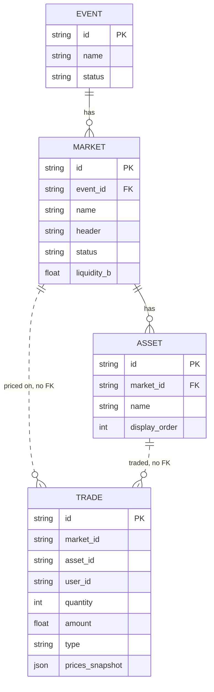
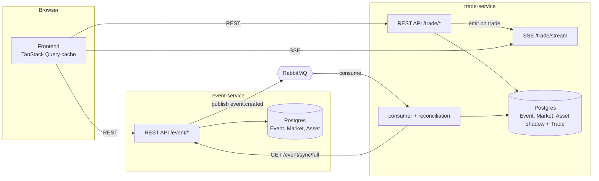

# prediction-market-frontend

The frontend for Prediction Market, a prediction-market trading UI. Lists events,
shows a live-updating price chart per market, and lets a (mock-authenticated) user
buy/sell shares, see their current positions, and review their own trade history.

Talks to event-service for event/market data and to trade-service for pricing,
trading, and live updates (REST + Server-Sent Events).

Built with React 19, Vite, Tailwind v4, shadcn/radix, TanStack Query, and recharts.

🔗 Live Demo: [prediction-market-frontend](https://prediction-market-frontend-gc4i.onrender.com/)

`Note: hosted on Render free tier. Initial load may take ~30 seconds on cold start.`

## Design

This is a plain client, it owns no data of its own. Everything shown here comes from
one of the two backend services:

- **event-service** for events, markets, and assets
- **trade-service** for prices, quotes, trades, positions, trade history, and the live
  SSE stream

All API access goes through `src/lib/api.ts`, and every read/write from a component
goes through TanStack Query rather than a component managing its own fetch state.
Query keys are centralized in `src/hooks/use-trade-queries.ts`, so components that
need the same data (for example the trade panel and the positions panel both needing
a user's current holdings) share one cached request instead of firing their own.

Live updates come from a single Server-Sent Events connection per market
(`src/hooks/use-trade-live-sync.ts`), opened once per event page. It writes incoming
trades straight into the TanStack Query cache, and every component that reads from
that cache (the chart, the trade panel's live prices, the positions panel) re-renders
from it automatically. Nothing else in the app opens its own SSE connection.

Auth is a mock: a username typed into a login dialog is stored in `localStorage` and
sent as `user_id` on trade requests. There's no password and no real session, it
exists so different users' positions can be compared against each other.

## How it talks to the backends

- REST to event-service for listing and reading events/markets.
- REST to trade-service for quotes, trade execution, prices, positions, and trade
  history.
- One SSE connection to trade-service (`GET /trade/stream?market_id=`) per event page,
  used to keep prices, the chart, and positions live without polling.

The frontend never talks to RabbitMQ directly, and never talks to event-service and
trade-service's sync mechanism either, that's purely a backend-to-backend concern
between the two services.

## Services and tools used

- React 19 with `react-router` for routing
- Vite for the dev server and build
- Tailwind v4 with shadcn/radix components
- TanStack Query for server state and caching
- recharts for the price chart
- Hosted on [Render](https://render.com/) as a static site

## Data model

The frontend doesn't own any of this, it's shown here for context on what the two
backend services expose.



## How the whole system fits together



## Running

```
npm install
npm run dev
```

Runs on `http://localhost:5173`. Requires `VITE_EVENT_SERVICE_URL` and
`VITE_TRADE_SERVICE_URL` in `.env` (default to `http://localhost:3001` and
`http://localhost:3002`).
